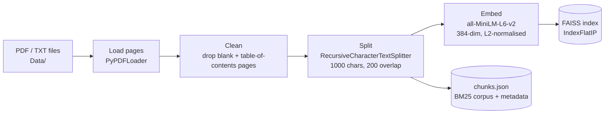
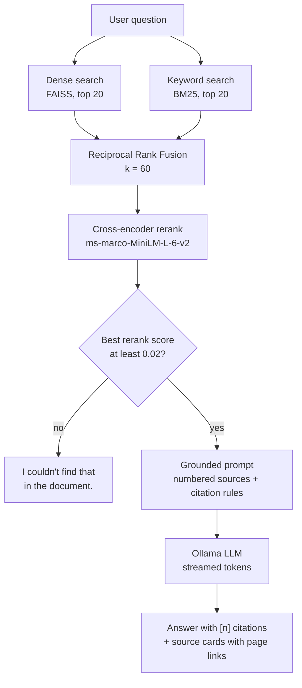

<p align="center">
  
</p>

<p align="center">
  
  
  
  
  
  
  
</p>

<p align="center">
  <b>Ask your documents. Get answers you can verify.</b><br>
  A local Retrieval-Augmented Generation (RAG) assistant that answers only from your own files,
  cites the exact page of every claim, and says <i>"I couldn't find that"</i> instead of guessing.
</p>

<p align="center">
  
</p>

---

## Table of contents

- [The idea](#the-idea)
- [Features](#features)
- [How it works](#how-it-works)
- [Why hybrid retrieval and reranking](#why-hybrid-retrieval-and-reranking)
- [Tech stack](#tech-stack)
- [Design decisions](#design-decisions)
- [Getting started](#getting-started)
- [Using the app](#using-the-app)
- [API reference](#api-reference)
- [Project structure](#project-structure)
- [Configuration](#configuration)
- [Known limitations and roadmap](#known-limitations-and-roadmap)
- [RAG cheat sheet](#rag-cheat-sheet)

---

## The idea

Large language models are fluent but they answer from frozen, generic memory. Ask one about *your*
internal report, handbook or contract and it will happily invent a plausible answer.

**RAG** (Retrieval-Augmented Generation) fixes this by splitting the job in two:

1. **Retrieve** the passages of your documents that are relevant to the question.
2. **Generate** an answer from *only* those passages, with citations back to the source.

Lola is a complete, readable implementation of that idea: nothing leaves your machine, there are no
API keys, and every answer can be traced to a page you can open and check.

The demo corpus is a 121-page internship report (a software-engineering PFE), but the pipeline works on
any mix of `.pdf` and `.txt` files you drop into `Data/`.

## Features

| | |
|---|---|
| **Grounded answers** | The model is instructed to use only the numbered passages it is given. |
| **Verifiable citations** | Every sentence carries `[n]` markers. Click one to jump to the source card, or open the PDF at that exact page. |
| **Honest "not found"** | If nothing relevant is retrieved the LLM is never called and Lola says so. |
| **Hybrid retrieval** | Dense vector search (meaning) and BM25 (exact words) combined with Reciprocal Rank Fusion. |
| **Cross-encoder reranking** | A second, more precise model re-scores the top 20 candidates. |
| **Transparent scoring** | Each source card shows its dense, BM25, RRF and rerank ranks and scores, so you can see *why* it was chosen. |
| **Switchable strategy** | Compare dense-only, keyword-only, hybrid and hybrid+rerank on the same question from the UI. |
| **Streaming UI** | Tokens stream in as they are generated; a live pipeline panel shows Retrieve, Generate and Cite stages. |
| **Fully local** | Embeddings, vector index, reranker and LLM all run on your machine via Hugging Face and Ollama. |

<table>
  <tr>
    <td width="50%"><br><sub><b>Home:</b> index status, model and strategy settings, suggested questions.</sub></td>
    <td width="50%"><br><sub><b>Off-topic question:</b> every rerank score is 0.00, so the model is skipped and Lola says it couldn't find an answer.</sub></td>
  </tr>
</table>

## How it works

Every RAG system is two pipelines: an **offline ingestion** job and an **online query** path.

### 1. Ingestion (run once, or whenever documents change)



Every chunk keeps `source`, `page` and `chunk_id` metadata. That metadata is what makes citations possible.

### 2. Query (every question)



## Why hybrid retrieval and reranking

Neither dense nor keyword search is enough on its own. Same question, same document
(*"What technologies were used to build the platform?"*), top 3 pages returned by each strategy:

| Strategy | Top 3 pages | What it is good at |
|---|---|---|
| Dense (FAISS) | 36, 34, 21 | Meaning and paraphrase, but misses exact terms. |
| Keyword (BM25) | 41, 15, 26 | Exact words, but blind to synonyms. |
| Hybrid (RRF) | 41, 36, 26 | Pulls strong candidates from **both** lists. |
| Hybrid + rerank | 15, 119, 41 | A cross-encoder reads question and passage together and re-orders by true relevance. |

Dense and keyword search shared **zero** pages in their top 3, which is exactly why fusing them helps.
Try it yourself with the *Retrieval strategy* dropdown, or from the terminal:

```bash
python -X utf8 retrieve.py "What technologies were used to build the platform?"
```

## Tech stack

| Layer | Technology | Role |
|---|---|---|
| Document loading | `PyPDFLoader`, `TextLoader` (LangChain) | One document per page, with page metadata. |
| Chunking | `RecursiveCharacterTextSplitter` (1000 / 200) | Splits on paragraphs, then sentences, then words. |
| Embeddings | `HuggingFaceEmbeddings` with `all-MiniLM-L6-v2` | 384-dimensional sentence vectors, normalised. |
| Vector search | FAISS `IndexFlatIP` | Exact inner-product (= cosine) search. |
| Keyword search | `rank_bm25` (BM25Okapi) | Exact-term ranking. |
| Fusion | Reciprocal Rank Fusion (hand-written, 8 lines) | Merges rankings without mixing incompatible scores. |
| Reranking | `cross-encoder/ms-marco-MiniLM-L-6-v2` (sentence-transformers) | Precise re-scoring of the top 20. |
| LLM | Ollama (`llama3.2:3b` by default) via `langchain-ollama` | Local generation, streamed. |
| Prompting | LangChain `ChatPromptTemplate` + `StrOutputParser` | Grounded prompt with citation rules. |
| API | FastAPI + Uvicorn | JSON endpoints and an NDJSON token stream. |
| UI | Vanilla HTML / CSS / JS (single file) | Chat, settings, citations, dark mode. No build step. |

## Design decisions

The choices that most affect quality, and the reasoning behind them:

| Decision | Choice | Why |
|---|---|---|
| Chunk size / overlap | 1000 / 200 characters | Big enough to hold a complete thought, small enough that one embedding stays about one topic. Overlap stops facts at a boundary from being orphaned. |
| Vector normalisation | Unit-length embeddings + inner product | Makes inner product identical to cosine similarity, so scores are directly interpretable (0 to 1). |
| Index type | Flat (exact) | At a few hundred chunks, exact search is instant and removes approximation as a variable. Swap to HNSW/IVF at scale. |
| Fusion method | RRF with k = 60 | Works on rank positions, so cosine scores and BM25 scores (different scales) never need to be compared. |
| Retrieve wide, rerank narrow | 20 candidates, then top 4 to the LLM | Cheap models find candidates; the expensive, accurate one only sees a short list. |
| Skip table-of-contents pages | Drop pages with 8 or more dotted leaders | Pages like `Chapter 2 . . . . . 17` embed into noise chunks that match many queries and answer none. |
| Relevance gate | Skip the LLM if best rerank score is below 0.02 | Off-topic questions score about 0.00 on every chunk, relevant ones 0.2 to 1.0. Saves time and guarantees an honest answer. |
| Prompt discipline | Rules in the system prompt **and** repeated beside the question | Small models follow instructions placed next to the question far more reliably. |
| Model | `llama3.2:3b`, temperature 0.1, 4096 context | Fits fully in a 4 GB GPU; low temperature keeps answers close to the sources. |
| Streaming | NDJSON: `sources` event first, then `token` events | The user sees the evidence immediately, then the answer builds up. |

## Getting started

### Prerequisites

- **Python 3.12**
- **[Ollama](https://ollama.com)** installed and running
- About 2.5 GB of free disk space: the `llama3.2:3b` model is 2 GB, and the first run also downloads the
  embedding model and the reranker (about 90 MB each) from Hugging Face.

### Install

```bash
git clone https://github.com/hadil-sgh/Lola-Enterprise-Knowledge-Assistant.git
cd Lola-Enterprise-Knowledge-Assistant

python -m venv venv
# Windows:      venv\Scripts\activate
# macOS/Linux:  source venv/bin/activate

pip install -r requirements.txt
ollama pull llama3.2:3b
```

### Add your documents

Put your `.pdf` and `.txt` files in `Data/`. Files in `Data/samples/` are intentionally **not** indexed.
PDFs in `Data/` are git-ignored so private documents never get committed.

### Build the index and run

```bash
python -X utf8 ingest.py     # optional: the UI can also build the index for you
python -X utf8 app.py
```

Open **http://127.0.0.1:8000**. If no index exists yet, the UI shows a **Build index** button.
Indexing the 121-page demo report takes roughly 30 to 60 seconds on CPU and produces 154 chunks.

> On Windows, `-X utf8` avoids encoding errors when printing non-ASCII text from PDFs.

### Try the pieces from the terminal

```bash
python -X utf8 retrieve.py "your question"   # compare all four retrieval strategies
python -X utf8 generate.py "your question"   # retrieve, then stream a grounded answer
```

## Using the app

- **Language model:** any chat model installed in Ollama appears in the dropdown (embedding models are hidden).
- **Retrieval strategy:** switch between hybrid + rerank, hybrid, dense only and keyword only, and watch the source ranks change.
- **Passages sent to the model:** how many top chunks go into the prompt (1 to 8, default 4). More context means slower answers.
- **Citations:** click a `[n]` marker to highlight its source card; click a card's text to expand it; use **Open in PDF** to jump to the page.
- **Stop button:** cancels generation mid-stream.

## API reference

| Method | Path | Description |
|---|---|---|
| `GET` | `/` | The chat UI. |
| `GET` | `/api/status` | Index stats (`chunks`, `files`), Ollama availability and installed models. |
| `POST` | `/api/ingest` | Re-reads `Data/`, rebuilds the index, reloads the retriever. Returns pages, chunks and timing. |
| `POST` | `/api/chat` | Retrieve, rerank and generate. Streams NDJSON. |
| `GET` | `/doc/{filename}` | Serves a file from `Data/` (used for "Open in PDF" page links). |

`POST /api/chat` request body:

```json
{ "question": "Which methodology was used?", "mode": "hybrid+rerank", "top_k": 4, "model": "llama3.2:3b" }
```

`mode` is one of `dense`, `bm25`, `hybrid`, `hybrid+rerank`. `top_k` is 1 to 8. `model` is optional.

The response is one JSON object per line:

```jsonc
{"type": "sources", "mode": "hybrid+rerank", "sources": [{"chunk_id": 20, "page": 22, "text": "...", "ranks": {"dense": 3, "bm25": 1}, "scores": {"dense": 0.35, "bm25": 14.2, "rrf": 0.032, "rerank": 0.34}}]}
{"type": "token", "text": "The Scrum methodology"}
{"type": "token", "text": " was used ..."}
{"type": "done", "gated": false}      // gated = true when the relevance gate skipped the LLM
// or, on failure: {"type": "error", "message": "..."}
```

## Project structure

```
Lola_Enterprise Knowledge Assistant/
├── app.py              FastAPI service: UI, status, ingest, streaming chat, document serving
├── ingest.py           Offline pipeline: load, clean, split, embed, index (FAISS + chunks.json)
├── retrieve.py         Dense + BM25 search, RRF fusion, cross-encoder rerank, 4 strategies
├── generate.py         Grounded prompt, Ollama streaming, model listing
├── Frontend/
│   └── chat.html       Single-file chat UI (no build step)
├── Data/               Your documents (PDFs are git-ignored); samples/ is not indexed
├── index_store/        Generated: faiss index, pickle, chunks.json (git-ignored)
├── docs/images/        README banner and screenshots
├── Rag-learning-plan.md  The original build-to-learn plan this project grew from
└── requirements.txt
```

## Configuration

| Setting | Where | Default |
|---|---|---|
| `OLLAMA_MODEL` | environment variable | `llama3.2:3b` |
| `OLLAMA_HOST` | environment variable | `http://localhost:11434` |
| `CHUNK_SIZE`, `CHUNK_OVERLAP` | `ingest.py` | `1000`, `200` |
| `EMBEDDING_MODEL` | `ingest.py` | `all-MiniLM-L6-v2` |
| `CANDIDATES`, `RRF_K`, `RERANK_MODEL` | `retrieve.py` | `20`, `60`, `cross-encoder/ms-marco-MiniLM-L-6-v2` |
| `MIN_RELEVANCE` | `app.py` | `0.02` |

After changing chunking or the embedding model, rebuild the index (the *Rebuild index* button, or `python ingest.py`).

Example, using a larger model for better answers at the cost of speed:

```bash
# PowerShell
$env:OLLAMA_MODEL = "llama3:latest"; python -X utf8 app.py
```

## Known limitations and roadmap

**Known limitations**

- **PDF text quality:** `pypdf` occasionally drops spaces on certain fonts (for example `TypeScriptisasuperset...`), which weakens keyword matching on those passages.
- **No conversation memory:** each question is answered independently; follow-ups like "and why?" will not work.
- **English-oriented embeddings:** `all-MiniLM-L6-v2` is weak on French and other languages.
- **Small-model behaviour:** a 3B model can occasionally skip citation markers or over-summarise. A larger model improves this.
- **Relevance threshold:** `MIN_RELEVANCE` was tuned on one document; re-check it on a new corpus.
- **`langchain-community` is being sunset upstream:** the loaders and FAISS wrapper will need migrating to standalone integration packages.

**Roadmap**

- [ ] Better PDF extraction (PyMuPDF) to fix glued words
- [ ] Chat memory with query rewriting for follow-up questions
- [ ] Evaluation harness: golden question set, hit-rate / MRR for retrieval, faithfulness checks for answers
- [ ] Multilingual embeddings for French and Arabic documents
- [ ] Upload documents from the UI
- [ ] HNSW index and metadata filters for larger corpora
- [ ] Docker Compose (app + Ollama)

## RAG cheat sheet

| Term | Meaning |
|---|---|
| **Chunk** | A small slice of a document. You embed and retrieve chunks, never whole documents. |
| **Embedding** | A vector of numbers capturing the meaning of a text. Similar meaning, nearby vectors. |
| **Bi-encoder** | Embeds query and passages independently, so passage vectors can be precomputed. Fast, approximate. |
| **Cross-encoder** | Reads query and passage together and scores them. Slow, precise, so used only on a short list. |
| **Dense retrieval** | Search by embedding similarity. Understands paraphrase, weak on exact codes and names. |
| **BM25** | Classic keyword-ranking algorithm. Exact terms, no understanding of synonyms. |
| **RRF** | Reciprocal Rank Fusion: `score = sum(1 / (k + rank))` across rankers. Merges lists by position. |
| **Grounding** | Instructing the model to answer only from supplied passages and to cite them. |
| **Top-k** | How many results to keep at each stage. |

## Author

Built by **Hadil Sghaier** as a hands-on project to learn RAG end to end, from chunking and embeddings
through hybrid retrieval and reranking to a streamed, cited chat experience.

The screenshots use the author's own internship report as the demo corpus. That report is not included in this repository.
