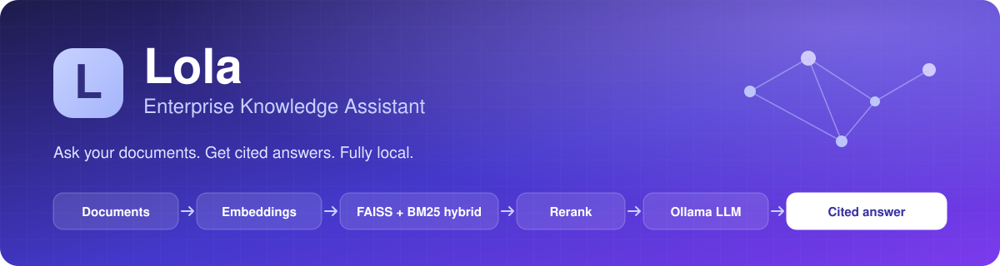
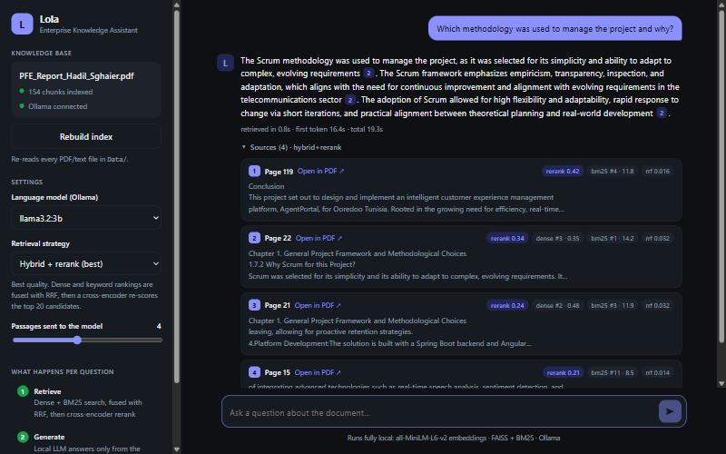
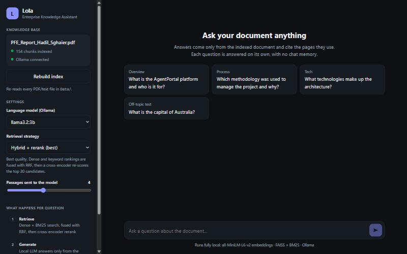
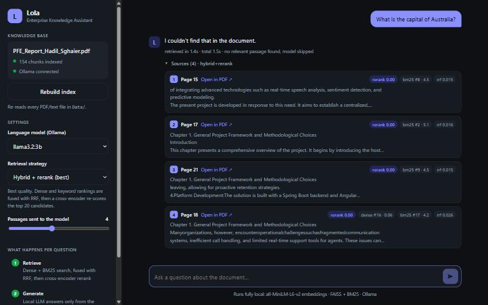
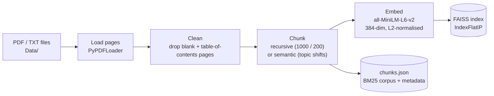
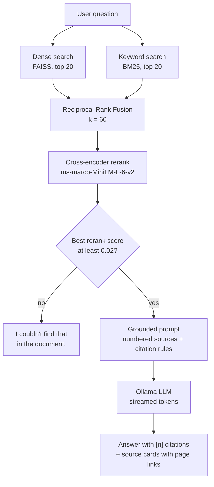

<p align="center">
  
</p>

<p align="center">
  
  
  
  
  
  
  
  
</p>

<p align="center">
  <b>Ask your documents. Get answers you can verify.</b><br>
  A local Retrieval-Augmented Generation (RAG) assistant that answers only from your own files,
  cites the exact page of every claim, and says <i>"I couldn't find that"</i> instead of guessing.
</p>

<p align="center">
  
</p>

---

## Table of contents

- [The idea](#the-idea)
- [Features](#features)
- [How it works](#how-it-works)
- [Why hybrid retrieval and reranking](#why-hybrid-retrieval-and-reranking)
- [Chunking: recursive vs semantic](#chunking-recursive-vs-semantic)
- [Evaluation](#evaluation)
- [Tech stack](#tech-stack)
- [Design decisions](#design-decisions)
- [Getting started](#getting-started)
- [Run with Docker](#run-with-docker)
- [Using the app](#using-the-app)
- [API reference](#api-reference)
- [Project structure](#project-structure)
- [Configuration](#configuration)
- [Known limitations and roadmap](#known-limitations-and-roadmap)
- [RAG cheat sheet](#rag-cheat-sheet)

---

## The idea

Large language models are fluent but they answer from frozen, generic memory. Ask one about *your*
internal report, handbook or contract and it will happily invent a plausible answer.

**RAG** (Retrieval-Augmented Generation) fixes this by splitting the job in two:

1. **Retrieve** the passages of your documents that are relevant to the question.
2. **Generate** an answer from *only* those passages, with citations back to the source.

Lola is a complete, readable implementation of that idea: nothing leaves your machine, there are no
API keys, and every answer can be traced to a page you can open and check.

The demo corpus is a 121-page internship report (a software-engineering PFE), but the pipeline works on
any mix of `.pdf` and `.txt` files you drop into `Data/`.

## Features

| | |
|---|---|
| **Grounded answers** | The model is instructed to use only the numbered passages it is given. |
| **Verifiable citations** | Every sentence carries `[n]` markers. Click one to jump to the source card, or open the PDF at that exact page. |
| **Honest "not found"** | If nothing relevant is retrieved the LLM is never called and Lola says so. |
| **Hybrid retrieval** | Dense vector search (meaning) and BM25 (exact words) combined with Reciprocal Rank Fusion. |
| **Cross-encoder reranking** | A second, more precise model re-scores the top 20 candidates. |
| **Two chunking strategies** | Recursive fixed-size windows, or semantic chunks cut where the topic changes. Both keep page metadata. |
| **Transparent scoring** | Each source card shows its dense, BM25, RRF and rerank ranks and scores, so you can see *why* it was chosen. |
| **Switchable strategy** | Compare dense-only, keyword-only, hybrid and hybrid+rerank on the same question from the UI. |
| **Measured, not assumed** | A three-level evaluation harness scores the test set, the retrieval and the answers. |
| **Streaming UI** | Tokens stream in as they are generated; a live pipeline panel shows Retrieve, Generate and Cite stages. |
| **Fully local** | Embeddings, vector index, reranker and LLM all run on your machine via Hugging Face and Ollama. |
| **One-command Docker** | `docker compose up` runs the app with both Hugging Face models baked into the image. |

<table>
  <tr>
    <td width="50%"><br><sub><b>Home:</b> index status, model and strategy settings, suggested questions.</sub></td>
    <td width="50%"><br><sub><b>Off-topic question:</b> every rerank score is 0.00, so the model is skipped and Lola says it couldn't find an answer.</sub></td>
  </tr>
</table>

## How it works

Every RAG system is two pipelines: an **offline ingestion** job and an **online query** path.

### 1. Ingestion (run once, or whenever documents change)



Every chunk keeps `source`, `page` and `chunk_id` metadata. That metadata is what makes citations possible.

### 2. Query (every question)



## Why hybrid retrieval and reranking

Neither dense nor keyword search is enough on its own. Same question, same document
(*"What technologies were used to build the platform?"*), top 3 pages returned by each strategy:

| Strategy | Top 3 pages | What it is good at |
|---|---|---|
| Dense (FAISS) | 36, 34, 21 | Meaning and paraphrase, but misses exact terms. |
| Keyword (BM25) | 41, 15, 26 | Exact words, but blind to synonyms. |
| Hybrid (RRF) | 41, 36, 26 | Pulls strong candidates from **both** lists. |
| Hybrid + rerank | 15, 119, 41 | A cross-encoder reads question and passage together and re-orders by true relevance. |

Dense and keyword search shared **zero** pages in their top 3, which is exactly why fusing them helps.
The [evaluation](#evaluation) below confirms it over a whole test set, not just one question.
Try it yourself with the *Retrieval strategy* dropdown, or from the terminal:

```bash
python -X utf8 retrieve.py "What technologies were used to build the platform?"
```

## Chunking: recursive vs semantic

How you cut the document decides what a "passage" even is, so Lola implements two strategies
(see [`chunking.py`](chunking.py)) and lets you measure them.

| | **Recursive** (default) | **Semantic** |
|---|---|---|
| Idea | Windows of about 1000 characters with 200 overlap, cut at the most natural separator that fits (paragraph, line, word). | Cut where the **topic changes**. |
| How | `RecursiveCharacterTextSplitter` | Split each page into sentences, embed every sentence together with its neighbours, measure `1 - cosine similarity` between consecutive sentences, and start a new chunk when that distance exceeds the 90th percentile of all gaps. |
| Guard rails | none needed | Never cut before 300 characters, always cut before 1500, fold a short tail back into the previous chunk. |
| Blind spot | Ignores meaning; can slice a thought in half. | Costs a full embedding pass before indexing; chunks vary in size. |
| Index build (demo report) | 154 chunks, about 23 s | 139 chunks, about 90 s |

Both strategies chunk **within a page**, never across pages, so every citation still points at one exact page.

Switch strategy when building the index:

```bash
python -X utf8 ingest.py                                          # recursive -> index_store/
python -X utf8 ingest.py --chunking semantic --out index_semantic # semantic  -> index_semantic/
```

Retrieval on the same 19-question test set, for both indexes:

| Strategy | Recursive: R@3 / R@5 / MRR / nDCG@5 | Semantic: R@3 / R@5 / MRR / nDCG@5 |
|---|---|---|
| Dense | 0.70 / 0.72 / 0.65 / 0.53 | 0.57 / 0.71 / 0.63 / 0.54 |
| Keyword (BM25) | 0.59 / 0.70 / 0.66 / 0.48 | 0.58 / 0.72 / 0.68 / 0.56 |
| Hybrid | 0.71 / 0.74 / **0.84** / 0.62 | 0.64 / 0.71 / 0.81 / 0.62 |
| Hybrid + rerank | 0.70 / **0.83** / 0.83 / 0.64 | **0.72** / 0.80 / **0.86** / **0.68** |

**Reading it honestly:** semantic chunking gives the full pipeline a small edge on ranking quality (MRR 0.83 to 0.86,
nDCG 0.64 to 0.68) but is slightly worse for dense-only and hybrid-only. With 19 questions, a single question
flipping moves a metric by about 0.05, so these differences are within noise. Semantic chunking is not a clear win
on this corpus, which is why recursive stays the default: it indexes four times faster. Semantic chunking is most
likely to pay off on documents with long, loosely structured prose rather than a structured report.

## Evaluation

"It seems to work" is not a result. [`evaluate.py`](evaluate.py) measures Lola at three levels:

| Level | What it checks | How |
|---|---|---|
| **1. Curate a test set** | Do we have a trustworthy ground truth? | [`eval/testset.json`](eval/testset.json): 19 answerable questions, each with the pages that hold the answer, verbatim evidence phrases and a reference answer, plus 3 unanswerable questions. `evaluate.py check` verifies every page and evidence phrase against the index. |
| **2. Measure retrieval** | Did we find the right passages? | Recall@K, Precision@K, MRR and nDCG@5 for each strategy. Relevance is judged **by page**, so the test set stays valid when you change the chunk size or strategy. |
| **3. Measure answers** | Is the final answer any good? | LLM-as-a-judge: a *different, larger* model (`llama3`) scores each answer 1 to 5 on accuracy, completeness and relevance against the reference. Refusals are tracked separately. |

```bash
python -X utf8 evaluate.py check                       # level 1: validate the test set
python -X utf8 evaluate.py retrieval                   # level 2: compare all four strategies
python -X utf8 evaluate.py answers                     # level 3: generate, then judge
python -X utf8 evaluate.py retrieval --index-dir index_semantic   # evaluate another index
```

### Level 2: retrieval (recursive index, 19 questions)

| Strategy | Recall@1 | Recall@3 | Recall@5 | Precision@3 | MRR | nDCG@5 |
|---|---|---|---|---|---|---|
| Dense | 0.34 | 0.70 | 0.72 | 0.42 | 0.65 | 0.53 |
| Keyword (BM25) | 0.34 | 0.59 | 0.70 | 0.32 | 0.66 | 0.48 |
| **Hybrid** | **0.54** | **0.71** | 0.74 | **0.44** | **0.84** | 0.62 |
| Hybrid + rerank | 0.46 | 0.70 | **0.83** | 0.42 | 0.83 | **0.64** |

- Fusing dense and keyword search is the biggest win: **MRR 0.65 and 0.66 become 0.84**, and Recall@1 climbs from 0.34 to 0.54.
- Reranking improves how many relevant pages appear in the top 5 (Recall@5 0.74 to 0.83) but does **not** beat plain hybrid at the very top of the list. Its value shows up when you send several passages to the LLM.

### Level 3: answers (hybrid + rerank, `llama3.2:3b` answering, `llama3` judging)

| | Accuracy | Completeness | Relevance | Overall |
|---|---|---|---|---|
| All 19 answerable questions | 4.21 | 3.63 | 4.37 | 4.07 |
| The 16 questions Lola actually answered | **4.81** | **4.12** | **5.00** | **4.65** |

- **14 of 16** answered questions scored 4 or more on every criterion, and **100%** of answers carry `[n]` citations.
- **3 of 3** unanswerable questions (one off-topic, two plausible but absent from the report) were correctly refused.
- **The real weakness is false refusals, not wrong answers:** Lola refused 3 of the 19 answerable questions. Two were blocked by
  the relevance gate (the supervisors on the title page and the host company, where the reranker scores the right passage only
  0.003 to 0.006 against a 0.02 threshold); one was refused by the 3B model even though retrieval had found the right page.
  Those three score 1/1/1 and account for the whole gap between 4.07 and 4.65.

Caveats: 22 questions is a small set; the judge is itself an LLM (a larger model of the same family, so it can be lenient); and the
test set was written from the same document it evaluates. Treat the numbers as a regression baseline, not an absolute grade.

## Tech stack

| Layer | Technology | Role |
|---|---|---|
| Document loading | `PyPDFLoader`, `TextLoader` (LangChain) | One document per page, with page metadata. |
| Chunking | `RecursiveCharacterTextSplitter` (1000 / 200) or hand-written semantic chunker | Splits pages into retrievable passages. |
| Embeddings | `HuggingFaceEmbeddings` with `all-MiniLM-L6-v2` | 384-dimensional sentence vectors, normalised. |
| Vector search | FAISS `IndexFlatIP` | Exact inner-product (= cosine) search. |
| Keyword search | `rank_bm25` (BM25Okapi) | Exact-term ranking. |
| Fusion | Reciprocal Rank Fusion (hand-written, 8 lines) | Merges rankings without mixing incompatible scores. |
| Reranking | `cross-encoder/ms-marco-MiniLM-L-6-v2` (sentence-transformers) | Precise re-scoring of the top 20. |
| LLM | Ollama (`llama3.2:3b` by default) via `langchain-ollama` | Local generation, streamed. |
| Prompting | LangChain `ChatPromptTemplate` + `StrOutputParser` | Grounded prompt with citation rules. |
| Evaluation | `evaluate.py` + an Ollama judge model | Test-set check, retrieval metrics, LLM-as-a-judge. |
| API | FastAPI + Uvicorn | JSON endpoints and an NDJSON token stream. |
| UI | Vanilla HTML / CSS / JS (single file) | Chat, settings, citations, dark mode. No build step. |
| Packaging | Docker + Docker Compose | CPU-only image with both Hugging Face models baked in. |

## Design decisions

The choices that most affect quality, and the reasoning behind them:

| Decision | Choice | Why |
|---|---|---|
| Chunk size / overlap | 1000 / 200 characters | Big enough to hold a complete thought, small enough that one embedding stays about one topic. Overlap stops facts at a boundary from being orphaned. |
| Default chunking | Recursive, not semantic | Measured: semantic is not clearly better on this corpus and indexes four times slower. |
| Chunk within pages | Never across a page break | Keeps every citation pointing at one exact, openable page. |
| Vector normalisation | Unit-length embeddings + inner product | Makes inner product identical to cosine similarity, so scores are directly interpretable (0 to 1). |
| Index type | Flat (exact) | At a few hundred chunks, exact search is instant and removes approximation as a variable. Swap to HNSW/IVF at scale. |
| Fusion method | RRF with k = 60 | Works on rank positions, so cosine scores and BM25 scores (different scales) never need to be compared. |
| Retrieve wide, rerank narrow | 20 candidates, then top 4 to the LLM | Cheap models find candidates; the expensive, accurate one only sees a short list. |
| Skip table-of-contents pages | Drop pages with 8 or more dotted leaders | Pages like `Chapter 2 . . . . . 17` embed into noise chunks that match many queries and answer none. |
| Relevance gate | Skip the LLM if best rerank score is below 0.02 | Off-topic questions score about 0.00 on every chunk, relevant ones usually 0.2 to 1.0. Saves time and guarantees an honest answer. The evaluation shows it is slightly too strict (2 false blocks in 19). |
| Page-level relevance in the test set | A chunk is relevant if its page is | The test set survives any change of chunk size or strategy. |
| Judge is not the generator | `llama3` grades `llama3.2:3b` | A model should not grade its own homework. |
| Prompt discipline | Rules in the system prompt **and** repeated beside the question | Small models follow instructions placed next to the question far more reliably. |
| Model | `llama3.2:3b`, temperature 0.1, 4096 context | Fits fully in a 4 GB GPU; low temperature keeps answers close to the sources. |
| Streaming | NDJSON: `sources` event first, then `token` events | The user sees the evidence immediately, then the answer builds up. |
| Container | CPU-only torch, models baked in, loopback-only port | Smaller image, no internet needed at runtime, and the unauthenticated API is not exposed to the network. |

## Getting started

### Prerequisites

- **Python 3.12**
- **[Ollama](https://ollama.com)** installed and running
- About 2.5 GB of free disk space: the `llama3.2:3b` model is 2 GB, and the first run also downloads the
  embedding model and the reranker (about 90 MB each) from Hugging Face.

### Install

```bash
git clone https://github.com/hadil-sgh/Lola-Enterprise-Knowledge-Assistant.git
cd Lola-Enterprise-Knowledge-Assistant

python -m venv venv
# Windows:      venv\Scripts\activate
# macOS/Linux:  source venv/bin/activate

pip install -r requirements.txt
ollama pull llama3.2:3b
```

### Add your documents

Put your `.pdf` and `.txt` files in `Data/`. Files in `Data/samples/` are intentionally **not** indexed.
PDFs in `Data/` are git-ignored so private documents never get committed.

### Build the index and run

```bash
python -X utf8 ingest.py     # optional: the UI can also build the index for you
python -X utf8 app.py
```

Open **http://127.0.0.1:8000**. If no index exists yet, the UI shows a **Build index** button.
Indexing the 121-page demo report takes roughly 30 to 60 seconds on CPU and produces 154 chunks.

> On Windows, `-X utf8` avoids encoding errors when printing non-ASCII text from PDFs.

### Try the pieces from the terminal

```bash
python -X utf8 retrieve.py "your question"   # compare all four retrieval strategies
python -X utf8 generate.py "your question"   # retrieve, then stream a grounded answer
```

## Run with Docker

The image is CPU-only (a smaller download) and contains both Hugging Face models, so the container needs no
internet at runtime. Your documents are mounted read-only from `Data/`, and the index lives in a Docker volume.

**Default: reuse the Ollama already running on your machine** (keeps your GPU):

```bash
docker compose up --build
```

Open **http://127.0.0.1:8000** and click **Build index**. The container reaches your host's Ollama through
`host.docker.internal`.

**Self-contained: run Ollama in a container too** (CPU only unless you add GPU settings):

```bash
# bash / macOS / Linux
OLLAMA_HOST=http://ollama:11434 docker compose --profile with-ollama up --build
# PowerShell
$env:OLLAMA_HOST = "http://ollama:11434"; docker compose --profile with-ollama up --build

docker compose exec ollama ollama pull llama3.2:3b
```

Useful options (set as environment variables before `docker compose up`):

| Variable | Default | Meaning |
|---|---|---|
| `OLLAMA_HOST` | `http://host.docker.internal:11434` | Where the app finds Ollama. |
| `OLLAMA_MODEL` | `llama3.2:3b` | Default chat model. |
| `CHUNKING` | `recursive` | `recursive` or `semantic`, used when the index is built. |

Notes:

- The image is about 1.8 GB (CPU-only torch plus both models). The container runs as a non-root user.
- The port is published on `127.0.0.1` only because the app has no login.
- On Docker Desktop (Windows and macOS) the container reaches a host Ollama as-is; just make sure Ollama is running.
  On Linux, a host Ollama must listen on `0.0.0.0` (or use the bundled `with-ollama` profile) for the container to reach it.
- Verified by building the index inside the container, asking a question, and restarting: the index persists in the volume.

## Using the app

- **Language model:** any chat model installed in Ollama appears in the dropdown (embedding models are hidden).
- **Retrieval strategy:** switch between hybrid + rerank, hybrid, dense only and keyword only, and watch the source ranks change.
- **Passages sent to the model:** how many top chunks go into the prompt (1 to 8, default 4). More context means slower answers.
- **Citations:** click a `[n]` marker to highlight its source card; click a card's text to expand it; use **Open in PDF** to jump to the page.
- **Stop button:** cancels generation mid-stream.
- **Index panel:** shows how many chunks are indexed and which chunking strategy built them.

## API reference

| Method | Path | Description |
|---|---|---|
| `GET` | `/` | The chat UI. |
| `GET` | `/api/status` | Index stats (`chunks`, `files`, `chunking`), Ollama availability and installed models. |
| `POST` | `/api/ingest` | Re-reads `Data/`, rebuilds the index, reloads the retriever. Returns pages, chunks and timing. |
| `POST` | `/api/chat` | Retrieve, rerank and generate. Streams NDJSON. |
| `GET` | `/doc/{filename}` | Serves a file from `Data/` (used for "Open in PDF" page links). |

`POST /api/chat` request body:

```json
{ "question": "Which methodology was used?", "mode": "hybrid+rerank", "top_k": 4, "model": "llama3.2:3b" }
```

`mode` is one of `dense`, `bm25`, `hybrid`, `hybrid+rerank`. `top_k` is 1 to 8. `model` is optional.

The response is one JSON object per line:

```jsonc
{"type": "sources", "mode": "hybrid+rerank", "sources": [{"chunk_id": 20, "page": 22, "text": "...", "ranks": {"dense": 3, "bm25": 1}, "scores": {"dense": 0.35, "bm25": 14.2, "rrf": 0.032, "rerank": 0.34}}]}
{"type": "token", "text": "The Scrum methodology"}
{"type": "token", "text": " was used ..."}
{"type": "done", "gated": false}      // gated = true when the relevance gate skipped the LLM
// or, on failure: {"type": "error", "message": "..."}
```

## Project structure

```
Lola_Enterprise Knowledge Assistant/
├── app.py              FastAPI service: UI, status, ingest, streaming chat, document serving
├── ingest.py           Offline pipeline: load, clean, chunk, embed, index (FAISS + chunks.json)
├── chunking.py         Recursive and semantic chunking strategies
├── retrieve.py         Dense + BM25 search, RRF fusion, cross-encoder rerank, relevance gate
├── generate.py         Grounded prompt, Ollama streaming, model listing
├── evaluate.py         Three-level evaluation: test-set check, retrieval metrics, LLM-as-a-judge
├── eval/
│   └── testset.json    22 curated questions with relevant pages and reference answers
├── Frontend/
│   └── chat.html       Single-file chat UI (no build step)
├── Data/               Your documents (PDFs are git-ignored); samples/ is not indexed
├── index_store/        Generated: faiss index, pickle, chunks.json, index_meta.json (git-ignored)
├── Dockerfile          CPU-only image with the Hugging Face models baked in
├── docker-compose.yml  App (+ optional Ollama) with a persistent index volume
├── docs/images/        README banner and screenshots
├── Rag-learning-plan.md  The original build-to-learn plan this project grew from
└── requirements.txt
```

## Configuration

| Setting | Where | Default |
|---|---|---|
| `OLLAMA_MODEL` | environment variable | `llama3.2:3b` |
| `OLLAMA_HOST` | environment variable | `http://localhost:11434` |
| `CHUNKING` | environment variable / `ingest.py --chunking` | `recursive` |
| `INDEX_DIR` | environment variable / `ingest.py --out` | `index_store` |
| `HOST`, `PORT` | environment variable | `127.0.0.1`, `8000` |
| `CHUNK_SIZE`, `CHUNK_OVERLAP` | `chunking.py` | `1000`, `200` |
| `BREAKPOINT_PERCENTILE`, `MIN_CHARS`, `MAX_CHARS` | `chunking.py` | `90`, `300`, `1500` |
| `EMBEDDING_MODEL` | `ingest.py` | `all-MiniLM-L6-v2` |
| `CANDIDATES`, `RRF_K`, `RERANK_MODEL` | `retrieve.py` | `20`, `60`, `cross-encoder/ms-marco-MiniLM-L-6-v2` |
| `MIN_RELEVANCE` | `retrieve.py` | `0.02` |
| `JUDGE_MODEL` | `evaluate.py` | `llama3:latest` |

After changing chunking or the embedding model, rebuild the index (the *Rebuild index* button, or `python ingest.py`).

Example, using a larger model for better answers at the cost of speed:

```bash
# PowerShell
$env:OLLAMA_MODEL = "llama3:latest"; python -X utf8 app.py
```

## Known limitations and roadmap

**Known limitations**

- **False refusals:** the evaluation shows the relevance gate is too strict for "who / which company" style questions, and the 3B
  model occasionally refuses when the answer is in its sources (3 of 19 answerable questions).
- **PDF text quality:** `pypdf` occasionally drops spaces on certain fonts (for example `TypeScriptisasuperset...`), which weakens keyword matching on those passages.
- **No conversation memory:** each question is answered independently; follow-ups like "and why?" will not work.
- **English-oriented embeddings:** `all-MiniLM-L6-v2` is weak on French and other languages.
- **Small evaluation set:** 22 questions from one document; differences of about 0.05 between strategies are noise.
- **Single-document scale:** tested on one 121-page PDF with an exact flat index; larger corpora need an approximate index.
- **`langchain-community` is being sunset upstream:** the loaders and FAISS wrapper will need migrating to standalone integration packages.

**Roadmap**

- [x] Evaluation harness: curated test set, retrieval metrics, LLM-as-a-judge
- [x] Semantic chunking, compared against recursive chunking
- [x] Docker Compose (app + optional Ollama)
- [ ] Fix the false refusals: tune or replace the relevance gate using the evaluation set, then re-measure
- [ ] Better PDF extraction (PyMuPDF) to fix glued words
- [ ] Chat memory with query rewriting for follow-up questions
- [ ] Faithfulness check: verify each cited claim is actually supported by its source passage
- [ ] Multilingual embeddings for French and Arabic documents
- [ ] Upload documents from the UI
- [ ] HNSW index and metadata filters for larger corpora

## RAG cheat sheet

| Term | Meaning |
|---|---|
| **Chunk** | A small slice of a document. You embed and retrieve chunks, never whole documents. |
| **Semantic chunking** | Cutting where the topic changes, detected by the similarity drop between consecutive sentence embeddings. |
| **Embedding** | A vector of numbers capturing the meaning of a text. Similar meaning, nearby vectors. |
| **Bi-encoder** | Embeds query and passages independently, so passage vectors can be precomputed. Fast, approximate. |
| **Cross-encoder** | Reads query and passage together and scores them. Slow, precise, so used only on a short list. |
| **Dense retrieval** | Search by embedding similarity. Understands paraphrase, weak on exact codes and names. |
| **BM25** | Classic keyword-ranking algorithm. Exact terms, no understanding of synonyms. |
| **RRF** | Reciprocal Rank Fusion: `score = sum(1 / (k + rank))` across rankers. Merges lists by position. |
| **Grounding** | Instructing the model to answer only from supplied passages and to cite them. |
| **Top-k** | How many results to keep at each stage. |
| **Recall@K** | Share of the relevant pages that appear in the top K results. |
| **Precision@K** | Share of the top K results that are relevant. |
| **MRR** | Mean Reciprocal Rank: average of `1 / rank` of the first relevant result. Rewards putting a right answer first. |
| **nDCG** | Normalised Discounted Cumulative Gain: rewards relevant results the higher they are ranked. |
| **LLM-as-a-judge** | Using a (stronger, different) LLM to score answers against a reference on set criteria. |

## Author

Built by **Hadil Sghaier** as a hands-on project to learn RAG end to end, from chunking and embeddings
through hybrid retrieval and reranking to a streamed, cited chat experience, and then measuring it.

The screenshots use the author's own internship report as the demo corpus. That report is not included in this repository.
